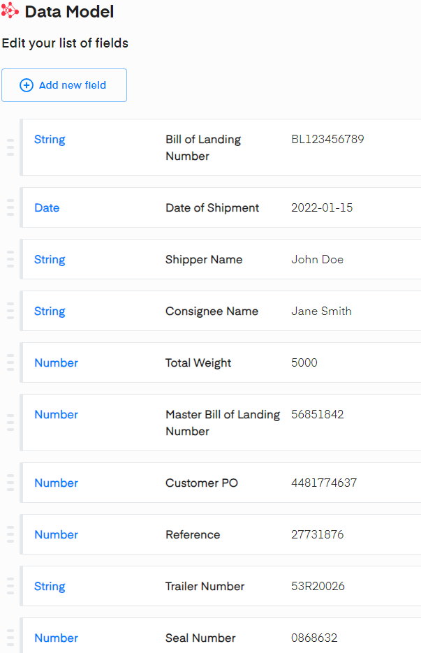
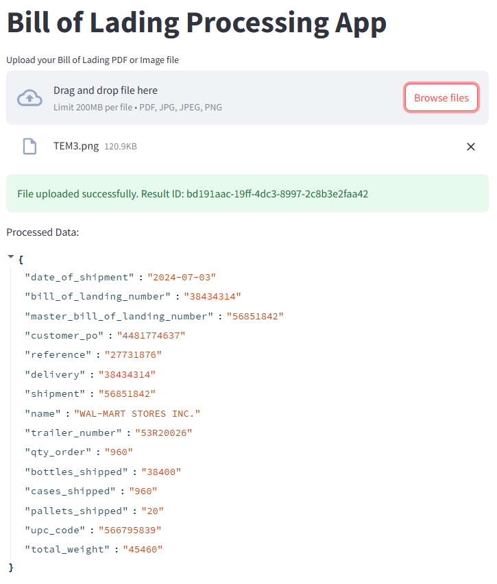
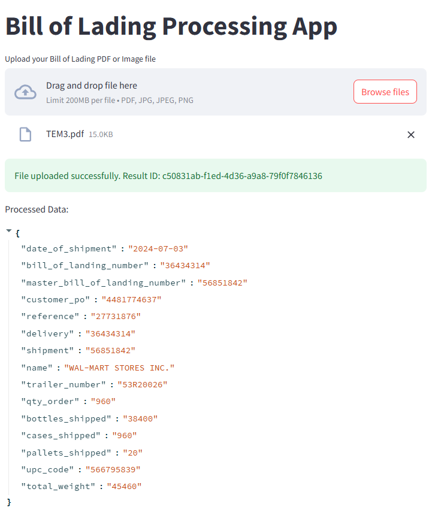
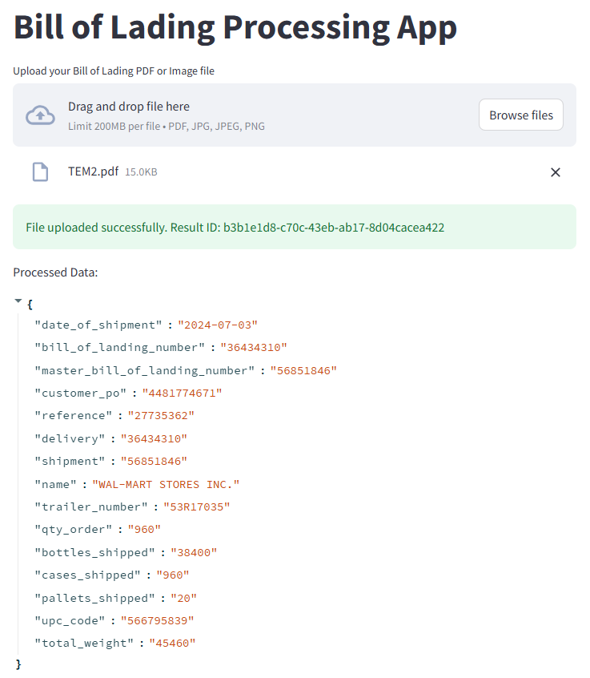

# Mindee OCR with FastAPI
This project provides a FastAPI-based service that allows users to upload PDF and image files (PNG, JPG, JPEG).
The service processes these files using the Mindee API to extract information and stores the results in temporary 
storage.
The project demonstrates the power of combining advanced OCR technology with a modern web framework, making it highly customizable and easy to use.

## Features
* Accepts both PDF and image file uploads.
* Processes PDF files using the Mindee API.
* Stores processed results in temporary storage.
* Provides an endpoint to retrieve the processing results.
* The Mindee API is custom-configured for the documents in the ```/data``` folder using docTI. 

This is the data model in the Mindee

&emsp;&emsp;&emsp; </td>


For different templates, you should change the configurations and the items in the ```core/processing.py``` file accordingly.

Project Structure:

``` 
├── .venv/
│   ├── Include/
│   ├── Lib/
│   ├── Library/
│   ├── Scripts/
│   ├── share/
│   └── pyvenv.cfg
│
├── app/
│   ├── api/
│   │   ├── __init__.py
│   │   └── endpoints.py
│   ├── core/
│   │   ├── __init__.py
│   │   ├── config.py
│   │   └── processing.py
├── data/
│       ├── TEM3.png
│       └── TEM3.pdf
├── tests/
│   ├── __init__.py
│   └── test.py
├── results/
│   ├── processed_pdf.png
│   ├── processed_pdf2.png
│   └── processed_png.png
│
├── requirements.txt
├── .env
├── .gitignore
└── README.md
```

## Installation
Clone the repository:
Copy code
```
git clone https://github.com/milosheskad/Mindee_OCR.git
cd Mindee_OCR
```
Create a virtual environment:
```
python3 -m venv venv
venv\Scripts\activate
```
Install the dependencies:
```
pip install -r requirements.txt
```
## Configuration
Set up your Mindee API credentials:

Open app/core/config.py and replace the api_key with your Mindee API key.
```
mindee_client = Client(api_key="your_mindee_api_key")
```


The default temporary directory is set to /tmp/. If you want to change it, modify the TEMP_DIR variable in app/api/endpoints.py.

## Running the Application

### Start the FastAPI application:

```uvicorn application.main:app --reload```

### Access interactive API:
Open your browser and navigate to http://127.0.0.1:8000/docs to see the interactive API documentation.

If the app is already running, you can start Streamlit with:

```streamlit run frontend_streamlit.py```

## Conclusion


The Mindee OCR with FastAPI project successfully processes PDF documents, though it encountered challenges with fields sharing the same name, often only capturing the first detected field. For image files, resolution played a crucial role; matching the image resolution to that of the PDF resolved these issues. Overall, the project efficiently extracts multiple fields from the provided templates, demonstrating its effectiveness and adaptability. Below is a graphic representation of the project:


<table>
  <tr>
    <td><strong>Document TEM3 in png format</strong></td>
    <td><strong>The same document TEM3 in pdf format</strong></td>
    <td><strong>Different document - TEM2.pdf </strong></td>
  </tr>
  <tr>
    <td></td>
    <td></td>
    <td></td>
  </tr>
</table>